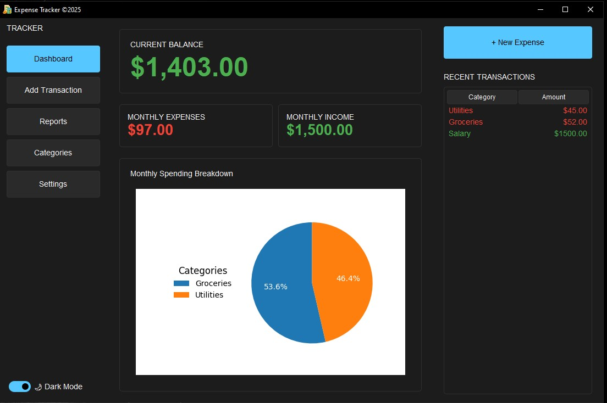
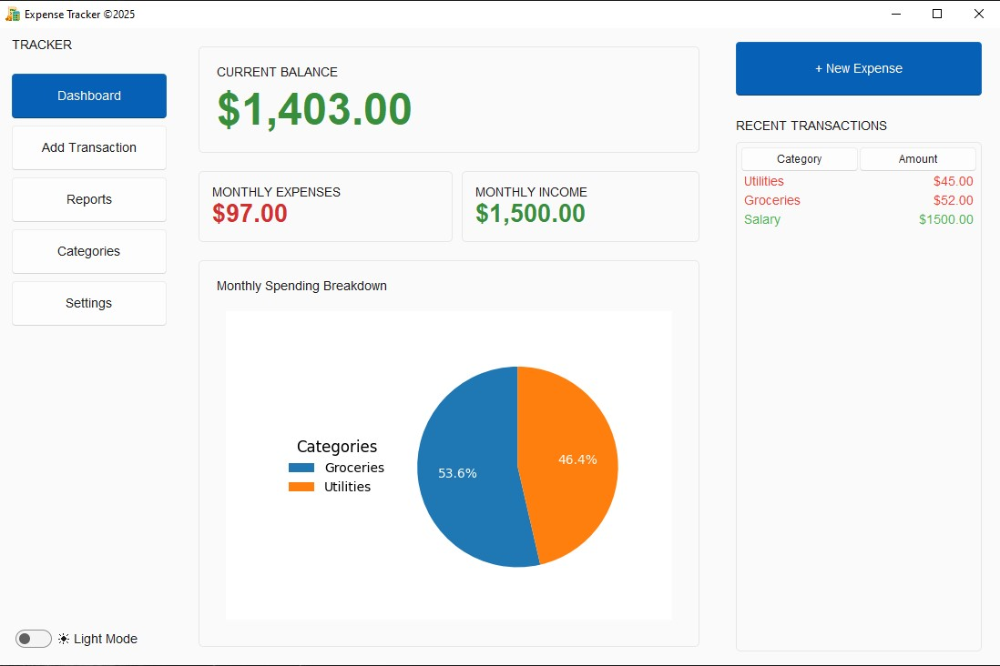
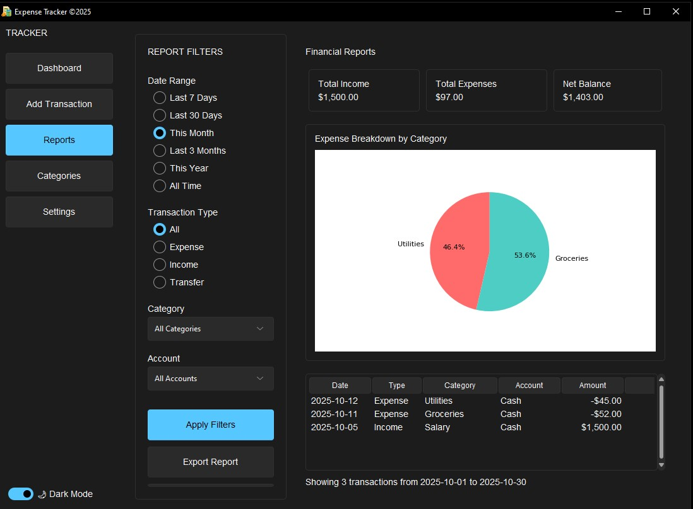

# Expense Tracker

A simple and intuitive application to help you track your income and expenses, manage budgets, and gain insights into your financial habits.





## Table of Contents
- [Installation](#installation)
- [Usage](#usage)

- [Contributing](#contributing)
- [License](#license)
- [Contact](#contact)

## Features of Expense Tracker
- **Add Transactions**: Record income and expenses with details like amount, category, and date.
- **Categorize Expenses**: Organize transactions into categories (e.g., Food, Rent, Salary).
- **Budget Management**: Set monthly budgets and track spending against them.
- **Reports & Insights**: Visualize spending patterns with charts and summaries.
- **Data Persistence**: Store transactions securely in a database or local storage.
- **Responsive Design**: Use the app on desktop or mobile devices.

## Technologies Used. 
- **UI**: used sv_ttk theme
- **Backend**: python
- **Database** (optional): SQLite
- **Charting**: matplotlib, pillow
- **Language**: python

## Installation
   **Clone the Repository**:
      ```bash
      git clone https://github.com/NimaZare/ExpenseTracker.git
      cd ExpenseTracker
      ```

   **To install Dependencies**:
      ```bash
      pip install -r requirements.txt
      ```

   **To run on Production**:
      ```bash
       python main.py
      ```

 ## Usage
### Add a Transaction:
- Navigate to the "Add Transaction" section.
- Enter details like amount, category (e.g., Food, Salary), and date.
- Click "Save" to record the transaction.
### Set a Budget:
- Go to the "Budgets" tab.
- Define a monthly budget for specific categories.
### View Reports:
- Check the "Reports" section for visual insights into your spending habits.
- Export Data (optional):
- Export transactions as a CSV file for external analysis.

## Contributing
Contributions are welcome! To contribute:
- Fork the repository.
- Create a new branch (git checkout -b feature/your-feature).
- Make your changes and commit (git commit -m "Add your feature").
- Push to the branch (git push origin feature/your-feature).
- Open a Pull Request.

### Please ensure your code follows the project's coding standards and includes relevant tests.

## License
This project is licensed under the MIT License.

## Contact
For questions or feedback, reach out to:
Email: contact@nimazare.info
GitHub Issues: Create an Issue and we would respond in a jiffy.


